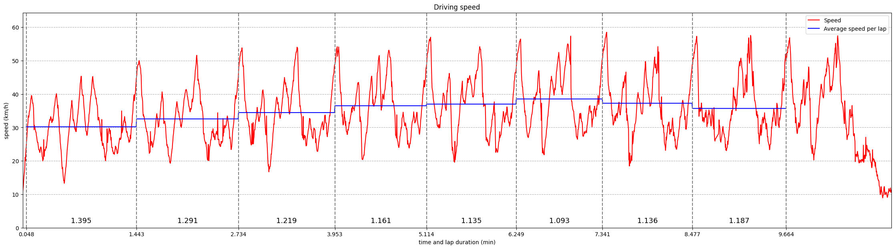
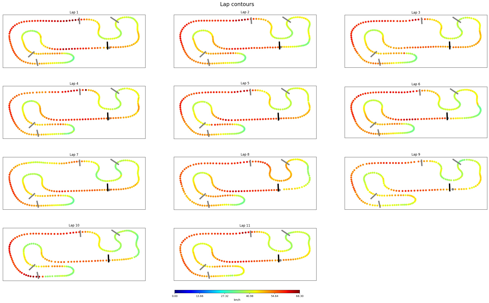

# Carting GoPro Video GPS Extraction And Analysis

Scripts for extracting GPS data from GoPro camera video and generating some graphs

## Extraction

GPS data is extracted from the video using the nodejs script inside the `GPSExtractor`.

This simple script just wraps [this](https://github.com/JuanIrache/gpmf-extract) and [this](https://github.com/JuanIrache/gopro-telemetry) great library provided by [JuanIrache](https://github.com/JuanIrache). 

To run the scrip you will need installed nodejs runtime.

Navigate to the `GPSExtractor` folder and install library dependencies.

```
cd GPSExtractor
npm install
```

Extractor supports creating `gpx`, `json` and `geojson` files, but the analysis part requires only `geojson`. It can also accept multiple files and concatenate extracted data, if the GoPro video has been split into smaller chunks by the camera.

```
node.exe extractGPS.js --geojson Video01.MP4 Video02.MP4 Video03.MP4
```

## Analysis

Analysis is done by the Python script inside the `GPSAnalyzer`. The script accepts the geojson file and produces graphs which can be easily tweaked.

```
cd GPSAnalyzer
python3 analyzeGPS.py extracted_path.geojson
```

## Sample Data 

Example `geojson` file created by the extractor is in `SampleData` and it produces following graphs:



