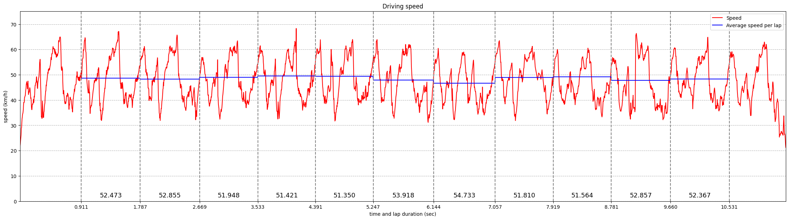
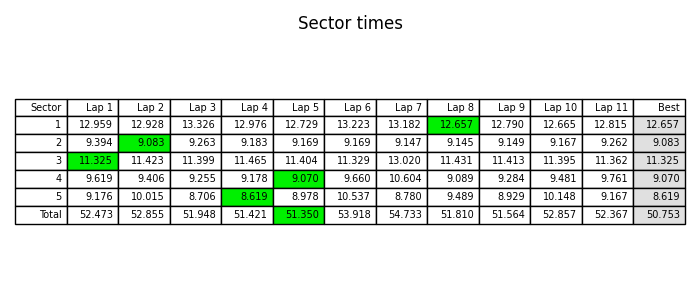
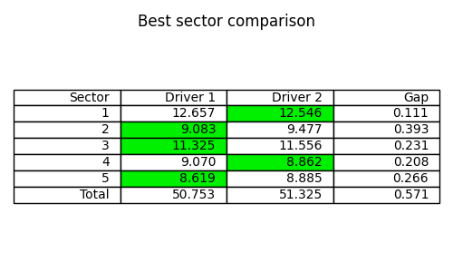

# Karting GoPro Video GPS Extraction And Analysis

Scripts for extracting GPS data from GoPro camera video and generating some graphs

## Extraction

GPS data is extracted from the video using the NodeJS script inside the `/extractor`.

This simple script just wraps [this](https://github.com/JuanIrache/gpmf-extract) and [this](https://github.com/JuanIrache/gopro-telemetry) great library provided by [JuanIrache](https://github.com/JuanIrache).

To run the script you will need NodeJS runtime installed.

Navigate to the `/extractor` folder and install library dependencies.

```
cd extractor
npm install
```

Extractor supports creating `gpx`, `json` and `geojson` files, but the analysis part requires only `geojson`. It can also accept multiple files and concatenate extracted data if the GoPro video has been split into smaller chunks by the camera.

```
node.exe extract.js --geojson extracted_path.geojson Video01.MP4 Video02.MP4 Video03.MP4
```

## Analysis

The analysis is done by the Python script inside the `/analyzer` directory. The script accepts a geojson file and produces graphs that can be easily tweaked. You can optionally include a track descriptor file that includes lines marking the start line and sector lines. A track descriptor example can be found in `/tracks` folder.

```
cd analyzer
python3 analyze.py extracted_path.geojson output_path [-t track_descriptor.track]
```

The analysis also produces a `sectors.npy` file which contains per sector information about the run. A pair of these files from different runs or different drivers can be compared using:

```
python3 compare_sectors.py output_path run1/sectors.npy run2/sectors.npy
```

## Sample Data

Example `geojson` file created by the extractor is in `sample_data` and it produces the following graphs:






When compared with another driver's run, the following comparison is generated:



More geojson examples and generated outputs from my drives can be found in the `/personal_runs` directory.